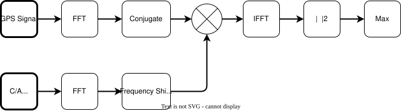
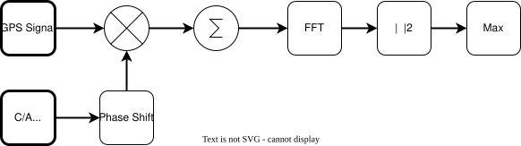

# Introduction

# System Overview

The GPS receiver is divided into a few main components:
* Acquisition
* Tracking
* Navigation

On a cold start, the receivers starts off with no knowledge of the current time or location of GPS satellites, so it has to blindly search for their signals. This is what the acquisition stage does. It searches through all permutations of frequency and code phase, and through every possible GPS satellite. It makes use of correlation in the frequency domain to greatly speed up this process. The result of this stage is a list of signals that were detected, along with their code phase and estimated frequency (after a secondary stage to reduce frequency error). This list is then passed on to the tracking channels.

Each detected signal is assigned a tracking channel to lock on to the exact frequency and code phase and keep track of it as it changes (ie, due to changing doppler shift). They also downsample the incoming signal to 1 ksps so it can be more easily demodulated to extract the 50 Hz navigation message.

navigation

# Acquisition

**Figure 1:** Block diagram of acquisition algorithm

The acquisition algorithm was primarily taken from *Holme* [1] and *Borre* [2].

## Fine Frequency Acquisition

TODO: make better https://dspguru.com/dsp/howtos/how-to-interpolate-fft-peak/

**Figure 2:** Block diagram of fine frequency acquisition algorithm

# Tracking

# Navigation

## Demodulation

## Timing

## Satellite Position

## Receiver Position

# References

1. http://www.aholme.co.uk/GPS/Main.htm
2. https://www.ocf.berkeley.edu/~marsy/resources/gnss/A%20Software-Defined%20GPS%20and%20Galileo%20Receiver.pdf
3. https://www.gps.gov/technical/icwg/IS-GPS-200M.pdf
